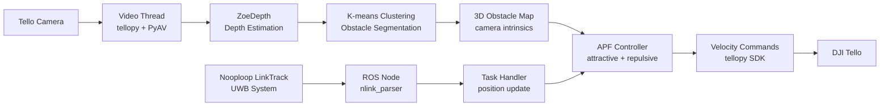
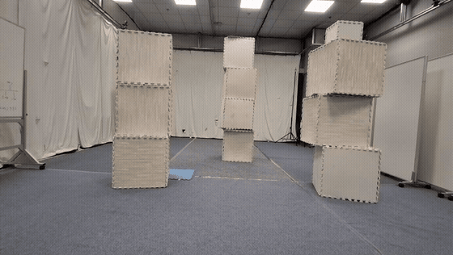
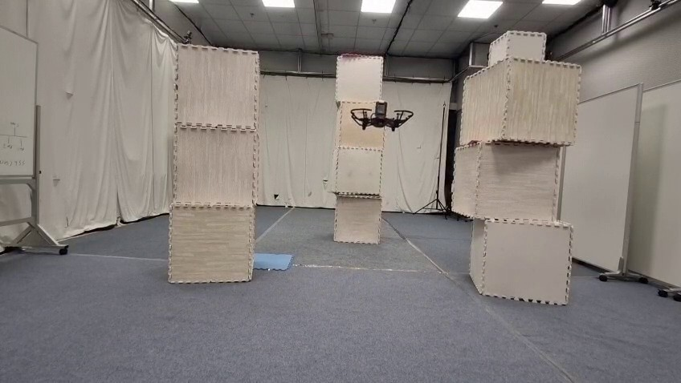
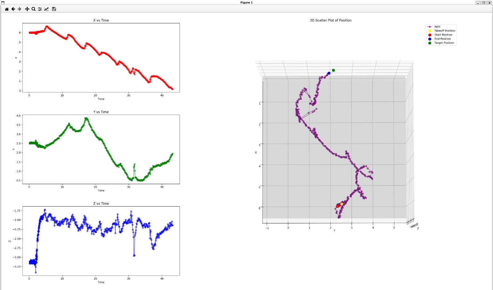
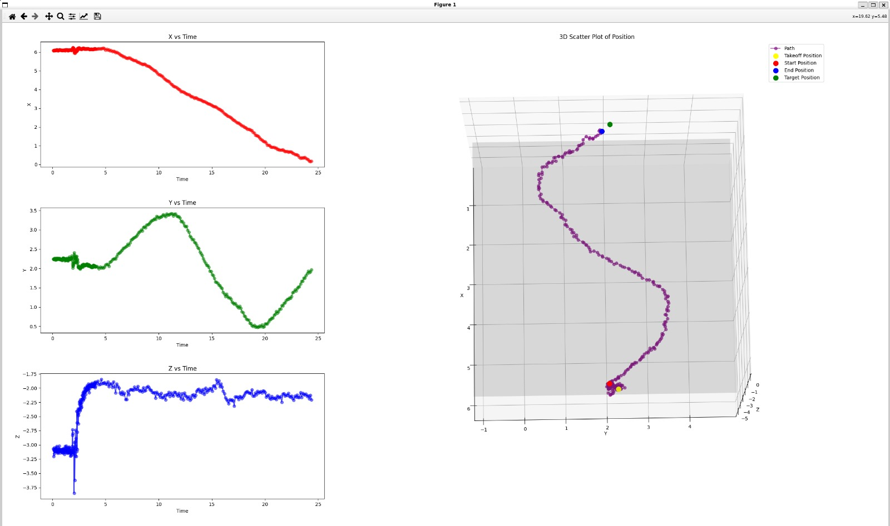

<div align="center">

# NTU UAV Research: Real-Time Drone Obstacle Avoidance

Real-time UAV obstacle avoidance using monocular depth estimation, UWB localisation, and Artificial Potential Fields for DJI Tello drones.

[](https://www.python.org/)
[](https://pytorch.org/)
[](https://www.ros.org/)
[](LICENSE)
[](../../commits)

### [Live Demo: APF 3D Navigator](https://horse-3903.onrender.com/ntu-uav-research-demo.html)

</div>

---

## Overview

**NTU-UAV-Research** implements a real-time perception-control pipeline for indoor obstacle avoidance on DJI Tello drones. The system estimates per-frame depth from a monocular camera using ZoeDepth, clusters the depth map to detect obstacles in 3D space, fuses that with absolute position from a Nooploop LinkTrack UWB system over ROS, and drives an Artificial Potential Field (APF) controller to navigate toward a target while avoiding detected obstacles. A PyBullet simulation environment is included for offline testing without hardware.

---

## Motivation

Small UAVs operating indoors face a hard set of practical constraints: limited onboard compute, noisy UWB localisation, motion blur, Wi-Fi video latency, imprecise depth from monocular cameras, and strict safety requirements. This project explores a lightweight perception-control pipeline that is deployable on a laptop connected to a Tello drone over Wi-Fi, without requiring stereo cameras, LiDAR, or GPU inference on the drone itself. The goal is end-to-end integration from live sensor input to real-time flight commands, under the constraints that make physical UAV deployment genuinely difficult.

---

## System Pipeline

```
DJI Tello Camera Feed (960x720, H.264 over Wi-Fi)
        ↓
Frame capture via PyAV + tellopy SDK
        ↓
ZoeDepth monocular depth estimation (HuggingFace Transformers)
        ↓
K-means depth clustering → obstacle segmentation + contour detection
        ↓
3D obstacle reconstruction via camera intrinsics (from calibration_data.npz)
        ↓
UWB absolute position (Nooploop LinkTrack → ROS /nlink_linktrack_nodeframe1)
        ↓
Obstacle list update (position + radius in world frame)
        ↓
Artificial Potential Field (attractive + repulsive + boundary forces)
        ↓
Velocity commands → tellopy SDK → Tello drone
```



---

## Architecture Overview

| Component | Purpose | Main Files |
|---|---|---|
| Drone interface | Connects to DJI Tello, sends velocity commands, receives telemetry | `task/tellodrone/core.py`, `task/tellodrone/flight_control.py` |
| Video capture | Decodes H.264 stream from Tello via PyAV, writes raw video | `task/tellodrone/video.py` |
| Depth estimation | Runs ZoeDepth on each frame to produce a metric depth map | `task/tellodrone/depth_model.py` |
| Obstacle detection | K-means clusters depth map, detects contours, reconstructs 3D positions | `task/tellodrone/map_obstacle.py` |
| UWB localisation | Subscribes to ROS topic, updates drone world position each callback | `task/main.py`, `src/track/uwb_position.py`, `cmd/uwb.sh` |
| OptiTrack (alt.) | Alternative motion-capture localisation via VRPN ROS bridge | `src/track/optitrack_position.py`, `cmd/optitrack.sh` |
| APF controller | Computes attractive + repulsive + boundary forces, maps to drone velocity | `task/apf.py`, `task/tellodrone/follow_path.py` |
| Simulation | PyBullet 3D simulator for offline APF testing without hardware | `task/sim.py`, `task/tellodrone_sim/core.py` |
| Logging | Per-run position log, config snapshot, annotated image saves | `task/tellodrone/log.py` |
| Camera calibration | Chessboard calibration to produce `calibration_data.npz` | `task/camera_calibrate.py`, `calibrate/` |
| Visualisation | Pygame live display with annotated depth and obstacle overlays | `task/tellodrone/video.py` |

---

## Hardware Requirements

- **DJI Tello drone** — tested with Tello (original); Tello EDU should be compatible
- **Nooploop LinkTrack UWB system** — provides absolute 3D position over serial/USB; requires `nlink_parser` ROS package
- **Laptop/workstation** — runs all inference and control; a discrete GPU is recommended for ZoeDepth inference speed, but CPU-only is functional
- **Wi-Fi** — direct connection to the Tello's access point (192.168.10.1)
- **Propeller guards** — strongly recommended for all indoor testing
- **Controlled indoor space** — minimum ~4×6 m clear area; UWB anchors must be pre-surveyed

> **OptiTrack alternative:** the repository also includes an OptiTrack VRPN integration (`cmd/optitrack.sh`, `src/track/optitrack_position.py`) as an alternative localisation source. Set the VRPN server IP in `cmd/optitrack.sh`.

---

## Software Requirements

| Dependency | Version | Notes |
|---|---|---|
| Python | 3.8 | ROS Noetic default |
| OS | Ubuntu 20.04 | ROS1 Noetic requirement |
| ROS | Noetic | Required for UWB/OptiTrack integration |
| `nlink_parser` | ROS package | Nooploop UWB ROS driver |
| `vrpn_client_ros` | ROS package | OptiTrack integration (optional) |
| PyTorch | 2.4.1 | CPU or CUDA; CUDA significantly faster |
| CUDA | 12.1 (optional) | Recommended for real-time depth inference |
| `tellopy` | 0.6.0 | Tello drone SDK (unofficial, low-latency) |
| `transformers` | 4.46.2 | ZoeDepth via HuggingFace |
| `opencv-python` | 4.10.0 | Depth clustering, image processing |
| `av` (PyAV) | 12.3.0 | H.264 video decoding |
| `pygame` | 2.6.1 | Live display window |
| `pybullet` | 3.2.6 | Physics simulation (offline mode) |
| `simple-pid` | 2.0.1 | PID utilities |
| `pyserial` | 3.4 | UWB serial communication |

---

## Installation

### 1. Clone the repository

```bash
git clone https://github.com/horse-3903/NTU-UAV-Research.git
cd NTU-UAV-Research
```

### 2. Set up a Python virtual environment

```bash
python3 -m venv .venv
source .venv/bin/activate   # Linux/macOS
# .venv\Scripts\activate    # Windows (simulation only — ROS not supported on Windows)
```

### 3. Install Python dependencies

```bash
pip install -r requirements.txt
```

For GPU-accelerated inference (recommended):

```bash
pip install torch==2.4.1 torchvision --index-url https://download.pytorch.org/whl/cu121
```

### 4. Install ROS dependencies (live drone mode only)

```bash
sudo apt install ros-noetic-desktop
sudo apt install ros-noetic-vrpn-client-ros   # OptiTrack only
```

Install the Nooploop `nlink_parser` package into your catkin workspace:

```bash
cd ~/catkin_ws/src
git clone https://github.com/nooploop-dev/nlink_parser.git
cd ~/catkin_ws && catkin_make
source devel/setup.bash
```

### 5. Download the ZoeDepth model weights

Model weights are not included in this repository (~1.5 GB). Download them via HuggingFace:

```bash
mkdir -p model
python -c "
from transformers import ZoeDepthForDepthEstimation, ZoeDepthImageProcessor
ZoeDepthImageProcessor.from_pretrained('isl-org/ZoeDepth', subfolder='ZoeDepthNK').save_pretrained('model/zoedepth-nyu-kitti')
ZoeDepthForDepthEstimation.from_pretrained('isl-org/ZoeDepth', subfolder='ZoeDepthNK').save_pretrained('model/zoedepth-nyu-kitti')
"
```

Expected structure after download:

```
model/
└── zoedepth-nyu-kitti/
    ├── config.json
    ├── model.safetensors
    └── preprocessor_config.json
```

### 6. Verify calibration data

`calibration_data.npz` is included in the repository and contains camera intrinsics calibrated for the Tello camera. If you need to recalibrate:

```bash
cd task
python camera_calibrate.py   # requires calibrate/*.jpg chessboard images
```

---

## Configuration

Sample configuration files are provided in `configs/`. These centralise parameters that are currently hardcoded and document all key tunables.

| File | Purpose |
|---|---|
| [`configs/drone.yaml`](configs/drone.yaml) | Drone connection, flight bounds, speed limits |
| [`configs/depth.yaml`](configs/depth.yaml) | Depth model path, inference interval, output directories |
| [`configs/uwb.yaml`](configs/uwb.yaml) | ROS topic, UWB coordinate convention |
| [`configs/control.yaml`](configs/control.yaml) | APF coefficients, waypoint tolerance, emergency stop |

---

## Quickstart

### A. Offline simulation (no hardware required)

Run the PyBullet APF simulation. Obstacles are randomly generated; the simulated drone navigates from start to target using the same APF controller as the live system.

```bash
cd task
python sim.py
```

The PyBullet GUI opens showing the drone (duck model), target (soccer ball), obstacle spheres, and boundary walls. The APF controller runs in real time.

### B. Offline depth demo on a static image (no drone required)

```bash
cd task
python -c "
from tellodrone.map_obstacle import process_image
from transformers import ZoeDepthForDepthEstimation, ZoeDepthImageProcessor
import cv2, torch, numpy as np
from PIL import Image

processor = ZoeDepthImageProcessor.from_pretrained('model/zoedepth-nyu-kitti')
model = ZoeDepthForDepthEstimation.from_pretrained('model/zoedepth-nyu-kitti')

img = cv2.imread('../calibrate/frame-621.jpg')
pil = Image.fromarray(img)
inputs = processor.preprocess(images=pil, return_tensors='pt')
with torch.no_grad():
    out = model(inputs['pixel_values'])
result = processor.post_process_depth_estimation(out, source_sizes=[(pil.height, pil.width)])
depth = result[0]['predicted_depth'].numpy()

rel = ((depth - depth.min()) / (depth.max() - depth.min()) * 255).astype('uint8')
cv2.imwrite('/tmp/depth_output.png', rel)
print('Saved depth map to /tmp/depth_output.png')
"
```

### C. Live drone mode (requires hardware + ROS)

**Terminal 1** — start the UWB system:

```bash
bash cmd/uwb.sh
```

**Terminal 2** — verify UWB data is streaming:

```bash
rostopic echo /nlink_linktrack_nodeframe1
```

**Terminal 3** — configure target position in `task/main.py`, then launch:

```bash
cd task
python main.py
```

The drone will take off, wait for the first depth estimation cycle (every 250 frames), then begin navigating toward the configured target using APF.

---

## Demo

### Live flight — DJI Tello navigating through foam-mat obstacles, NTU lab



*External overhead camera. The Tello drone navigates autonomously through three stacked foam-mat obstacle towers using APF control driven by ZoeDepth depth estimation and Nooploop LinkTrack UWB localisation. Full video: [`assets/demo_flight.mp4`](assets/demo_flight.mp4) (48 s, 10.6 MB).*

---

### Flight environment



*NTU lab setup: three stacked foam-mat columns arranged as obstacles across a 6.5 m traversal path. UWB anchors are installed at the room perimeter. The blue mat marks the landing zone.*

---

### Recorded flight trajectories (UWB position log)

| APF only (raw) | APF + PID control |
|:---:|:---:|
|  |  |
| 45 s flight, erratic lateral excursions | 25 s flight, smooth sinusoidal lateral path |

*Left: APF controller without PID — drone reaches target but path is noisy and oscillatory. Right: APF + PID — significantly smoother trajectory, ~44% reduction in flight time. Both plots show X/Y/Z vs time (left) and a 3D scatter of the recorded UWB path (right), with takeoff (yellow), start (red), end (blue), and target (green) markers.*

---

### Obstacle avoidance success rate

Across multiple runs in the NTU lab environment with the foam-mat obstacle course, the system successfully avoided obstacles **70–80% of the time** (as reported in the project presentation). Failure cases were primarily due to ZoeDepth not having updated its obstacle map before the drone entered the obstacle region (stale depth from the 250-frame inference interval), and occasional APF local minima.

---

## Method Details

### Monocular Depth Estimation

**Model:** ZoeDepth (`isl-org/ZoeDepth`, `ZoeDepthNK` variant) loaded from a local `model/zoedepth-nyu-kitti` directory via HuggingFace Transformers.

**Input:** 960×720 BGR frame from the Tello camera, converted to PIL RGB.

**Output:** `absolute_depth` — metric depth map in metres (float32 numpy array); `relative_depth` — 0–255 normalised grayscale for visualisation.

**Inference interval:** Every 250 frames during flight (`cur_frame_idx % 250 == 0`) to stay within the real-time control loop. A running average of the last 100 UWB position readings is used to anchor the depth snapshot to a stable world position.

**Limitations:** ZoeDepth produces relative metric depth calibrated for indoor/outdoor scenes (NYU + KITTI training data). Accuracy degrades on textureless, reflective, or overexposed surfaces. Depth is not fused across frames — each estimate is independent.

### Obstacle Segmentation

Implemented in `task/tellodrone/map_obstacle.py`:

1. **K-means clustering** (`cv2.kmeans`, k=5) on depth values to segment the depth map into depth layers.
2. **Dark cluster extraction** — the 3 nearest (smallest-depth) clusters are treated as potential obstacles.
3. **Row filtering** — rows where more than 85% of pixels belong to a cluster (likely a wall or floor plane) are masked out.
4. **Morphological cleaning** — opening with an 11×11 kernel followed by connected-component filtering (min area 20,000 px²) removes noise.
5. **Contour detection** — `cv2.findContours` on the cleaned binary map; each contour is fit with a minimum enclosing circle to get centroid + radius.
6. **3D reconstruction** — camera intrinsics from `calibration_data.npz` project each centroid pixel into 3D using the ZoeDepth absolute depth at that pixel. An offset of −0.4 m is applied on all axes to compensate for camera-to-body mounting.

### UWB Localisation

The Nooploop LinkTrack system provides 3D position via the `/nlink_linktrack_nodeframe1` ROS topic. Each callback in `task/main.py` calls `tello.task_handler(pos_arr)`, which updates `cur_pos` and triggers the active control task.

**Coordinate frame:** X forward (into the room), Y lateral, Z vertical (negative = up, matching the UWB anchor layout). World bounds are set to `x: [-0.50, 7.00]`, `y: [-0.50, 4.50]`, `z: [-3.75, -0.50]` metres for the test environment.

**Update rate:** Determined by the UWB system and ROS callback rate (~100 Hz typical). Position outliers are not filtered — boundary checks provide a safety override.

### Avoidance Control (APF)

Implemented in `task/apf.py` and `task/tellodrone/follow_path.py`:

The Artificial Potential Field computes three force components:

- **Attractive force:** `F_attr = k_attr × (target - cur) / |target - cur|` — pulls drone toward target, scaled by distance.
- **Repulsive force from obstacles:** `F_rep = k_rep × (1/d - 1/d_inf) × (1/d²)` for each obstacle within influence distance `d_inf = 0.5 m`.
- **Boundary repulsion:** Same formula applied to each axis wall at `bounds_influence_dist = 0.5 m` from the configured bounds.

Velocity commands are clamped to `max_val = 30` (tellopy speed units, roughly 0–100 scale) and mapped to `drone.forward/backward/left/right/up/down`. The control loop runs at the UWB callback rate with a 200 ms sleep at the end of each step.

**Emergency landing:** Battery below 5% triggers `shutdown(error=True)`, which calls `drone.land()` and exits. Out-of-bounds position also triggers immediate landing.

---

## Coordinate Frame Convention

```
        Y (lateral, positive right)
        |
        |
        +--------> X (forward, positive into room)
       /
      /
     Z (vertical, negative = up in this frame)
```

The Tello drone is assumed to face in the negative-X direction (`drone.forward()` moves in the −X world direction). The UWB anchor layout determines the absolute origin.

---

## Repository Structure

```
NTU-UAV-Research/
├── task/                        # Main runnable code
│   ├── main.py                  # Entry point (live drone + ROS)
│   ├── sim.py                   # Entry point (PyBullet simulation)
│   ├── apf.py                   # Artificial Potential Field algorithm
│   ├── vector.py                # Vector3D class
│   ├── camera_calibrate.py      # Camera calibration tool
│   ├── test_apf.py              # Manual APF bounds tests
│   ├── test_video.py            # Video/depth capture test
│   ├── tellodrone/              # TelloDrone class (live hardware)
│   │   ├── __init__.py
│   │   ├── core.py              # Main class, startup/shutdown
│   │   ├── depth_model.py       # ZoeDepth loading + inference
│   │   ├── map_obstacle.py      # Depth clustering + obstacle detection
│   │   ├── follow_path.py       # APF path following task
│   │   ├── flight_control.py    # Telemetry callback + bounds check
│   │   ├── task.py              # UWB callback handler
│   │   ├── video.py             # Video thread + pygame display
│   │   └── log.py               # Logging setup
│   └── tellodrone_sim/          # TelloDroneSim class (PyBullet)
│       ├── __init__.py
│       └── core.py              # Simulation environment + APF runner
├── src/                         # Utility and exploratory scripts
│   ├── control/pid.py           # PID controller prototype
│   ├── depth/                   # Standalone depth estimation scripts
│   ├── misc/                    # Camera + accuracy utilities
│   ├── track/                   # UWB + OptiTrack ROS subscribers
│   ├── util/                    # Position logging helpers
│   └── old/                     # Earlier prototype code (archived)
├── cmd/
│   ├── uwb.sh                   # Launch Nooploop LinkTrack ROS node
│   └── optitrack.sh             # Launch OptiTrack VRPN ROS bridge
├── calibrate/                   # Chessboard calibration frames (real)
├── configs/                     # Sample configuration files
├── tests/                       # Pytest unit tests (no hardware required)
├── calibration_data.npz         # Camera intrinsics (committed)
├── camera-icon.png              # Pygame display asset
├── requirements.txt             # Python dependencies
└── README.md
```

> **Note on `src/`:** This directory contains standalone utility scripts, early prototypes (`src/old/`), and timing benchmarks. It is not part of the main live-flight pipeline.

---

## Real-World Engineering Constraints

This section exists because these constraints are what make physical UAV deployment genuinely hard.

- **Monocular depth is relative, not perfectly metric.** ZoeDepth produces metric estimates, but these can drift in challenging indoor lighting, on textureless walls, or near highly reflective surfaces. Obstacle radii are approximate.
- **Depth estimation latency.** On CPU, a single ZoeDepth forward pass takes several seconds. This is why inference runs every 250 frames rather than every frame. The obstacle map lags reality.
- **UWB localisation noise.** Position readings have measurement noise and can jump briefly on multipath. No Kalman filter is applied — the running average over 100 readings partially smooths this.
- **Wi-Fi video drops.** The Tello streams H.264 video over its own Wi-Fi AP. Interference, range, or congestion can cause frame drops, stalls, or container decode errors. The video thread catches these exceptions and continues.
- **Control latency.** The full loop from UWB callback to drone command takes tens of milliseconds. The 200 ms sleep in `follow_path` prevents command flooding.
- **Safety overrides.** Battery below 5%, position outside configured bounds, and Ctrl+C all trigger `drone.land()` before exit.
- **APF local minima.** Artificial Potential Fields can produce local minima in complex obstacle configurations. The current implementation does not include escape mechanisms.

---

## Safety Notes

- Test in a clear indoor space with no people in the flight area.
- Always fit propeller guards before any powered test.
- Have a person physically present to take manual control or catch the drone.
- Verify control commands in simulation (`task/sim.py`) before live flight.
- Start with low APF coefficients (`attract_coeff`, `repel_coeff`) and short flight distances.
- Know where the emergency stop is: Ctrl+C triggers a clean land-and-shutdown sequence.
- Ensure battery is above 50% before any flight.
- Never fly near eyes, face, or loose clothing.

---

## Testing and Sanity Checks

Unit tests for hardware-independent logic are in `tests/`:

```bash
pip install pytest
pytest tests/
```

Tests cover: `Vector3D` arithmetic, APF force direction, obstacle update logic, and boundary repulsion — all without requiring a drone, ROS, or model weights.

To run the existing manual APF bounds test (prints PASS/FAIL):

```bash
cd task
python test_apf.py
```

---

## Limitations

- Not a fully autonomous navigation stack — requires a pre-configured target position and does not perform global path planning.
- Not guaranteed safe in uncontrolled environments — designed and tested for a specific indoor lab setup with known bounds.
- Depth estimation may fail under poor lighting, motion blur, or on highly reflective surfaces.
- UWB requires physical anchor installation and calibration for a new environment.
- No loop-closure or drift correction — the system relies entirely on UWB absolute position.
- APF does not handle local minima — the drone may stall in complex obstacle configurations.
- Live drone testing requires Ubuntu 20.04 + ROS Noetic; simulation works on any platform with PyBullet.
- No formal safety certification or redundancy.

---

## Future Work

- Temporal depth smoothing — moving average or Kalman filter over depth estimates to reduce noise
- SLAM integration — combine visual odometry with UWB to improve localisation robustness
- APF local minima escape — random perturbation or replanning when velocity falls below threshold
- Optical flow — use drone motion between frames to improve obstacle tracking
- Simulation-to-real transfer evaluation — quantitative comparison of APF behaviour in PyBullet vs. live flight
- Quantitative latency benchmark — measure end-to-end pipeline latency from frame capture to command
- Lightweight depth models — test MiDaS or Depth Anything for faster inference with acceptable accuracy
- ROS2 migration — move from ROS1 Noetic to ROS2 for longer-term support

---

## Why This Project Is Interesting

- **End-to-end integration.** The system covers the full pipeline from raw camera pixels and UWB serial data to real velocity commands on a physical drone — not a simulated environment.
- **Real-world robotics constraints.** Latency, noisy localisation, imperfect depth, and hardware unreliability are not edge cases here — they are the design context.
- **ML perception meets physical control.** ZoeDepth is a state-of-the-art depth model repurposed for obstacle detection within a classical APF control framework.
- **Offline validation path.** The PyBullet simulation allows the APF controller to be tuned and validated without hardware, reducing risk during live testing.
- **Dual localisation support.** Both UWB (Nooploop LinkTrack) and motion capture (OptiTrack VRPN) are integrated, showing how the architecture generalises across different sensor modalities.

---

## Tech Stack

[](https://www.python.org/)
[](https://pytorch.org/)
[](https://opencv.org/)
[](https://www.ros.org/)

---

## Authors

- **Rafael Chong** — depth estimation pipeline, APF controller, simulation environment
- **Ethan Phua** — PID controller prototype, path planning integration

Research conducted at Nanyang Technological University, School of Mechanical and Aerospace Engineering.

---

## Acknowledgements

This research was conducted under the supervision of **Dr. Wen Nuan** and **Assistant Professor Mir Feroskhan** (NTU-MAE). Their guidance and provision of lab facilities made this project possible.

---

## License

This project is licensed under the [MIT License](LICENSE).
